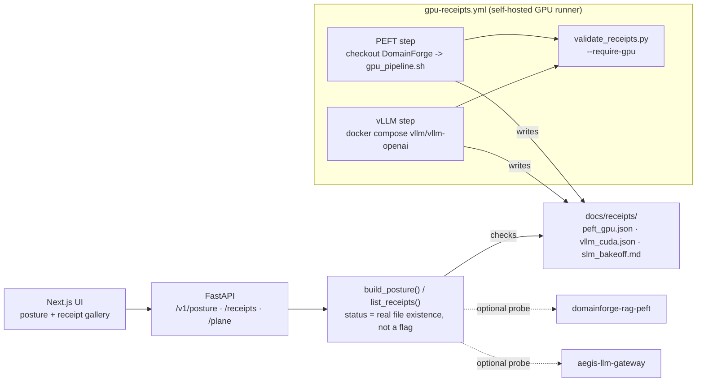

# ModelForge — Model Plane (SLM · PEFT · CUDA vLLM · LLMOps)


<!-- vpeetla-tech-stack:start -->
[]() []() []() []() []() []() []()
<!-- vpeetla-tech-stack:end -->

[](LICENSE)
[](https://github.com/vpeetla-ai)

**Hire hero for the Model Plane.** ModelForge is where a CAIO clicks when they ask about SLMs, fine-tuning, CUDA vLLM, and LLMOps — not another agent demo.

> Agents decide *what to do*. ModelForge decides *which weights, where they run, and how we prove it.*

**Plan:** [MODEL_PLANE_100_PLAN](https://github.com/vpeetla-ai/ai-architecture-portfolio/blob/main/docs/MODEL_PLANE_100_PLAN.md) · **ADR-034** · Tracker

## Architecture

Full diagram + component-by-component honesty notes: [docs/ARCHITECTURE.md](docs/ARCHITECTURE.md).



## Honest status

| Component | Status | Notes |
|-----------|--------|-------|
| Posture API (`/v1/posture`) | ✅ | Machine-readable honesty |
| Receipts gallery API | ✅ | PEFT / vLLM / SLM — real receipts published, see below |
| Model Plane UI | 🟡 | MVP tabs; polish in Phase 1 |
| DomainForge live probe | 🟡 | Optional `DOMAINFORGE_URL` |
| LLM gateway probe | 🟡 | Optional `LLM_GATEWAY_URL` |
| CUDA vLLM compose | ✅ | `docker-compose.vllm.yml` — validated against a real self-hosted GPU runner serving its actual configured model; receipt: `docs/receipts/vllm_cuda.json` (run `vllm-20260903T225117Z`, 1x NVIDIA L4, Mistral-7B-Instruct-v0.3, 13.74 tok/s, p50 371.67ms) |
| GPU PEFT receipt artifact | ✅ | `docs/receipts/peft_gpu.json` (run `peft-20260904T055541Z`, 1x NVIDIA L4, real QLoRA SFT [378 ex/200 steps/829s] + DPO [16 pairs/100 steps/1018s] on Mistral-7B-Instruct-v0.3) — CI (`ci.yml`) runs `validate_receipts.py --require-gpu`, so this can't silently regress to unclaimed. Reports real training config/timing only; does not claim a quality/win-rate score (see the receipt's own `known_gaps` — DomainForge's S0-S4 eval harness isn't wired to real adapter inference yet) |
| SLM bake-off table | ✅ | `docs/receipts/slm_bakeoff.md` — real local-Ollama (`llama3.2:1b`, 3/3 schema-pass, 3.415s mean) vs real cloud API (Groq `openai/gpt-oss-20b`, 3/3 schema-pass, 0.386s mean) |
| Always-on GPU | ❌ | Ephemeral self-hosted runner via `gpu-receipts.yml` (`workflow_dispatch`, GPU-labeled); free tier is CPU/API between runs |

## Quick start

```bash
python3.11 -m venv .venv && source .venv/bin/activate
pip install -e ".[dev]"
pytest -q
uvicorn modelforge_llmops.api.main:app --reload --port 8200
# → http://127.0.0.1:8200/health  ·  /v1/posture  ·  /docs
```

```bash
cd ui && npm install && npm run dev
# set NEXT_PUBLIC_API_URL=http://127.0.0.1:8200
```

## SLM bake-off (Phase 4)

```bash
# Ollama OpenAI-compatible shim (example)
python scripts/slm_bakeoff.py --base-url http://127.0.0.1:11434 --model llama3.2:3b --label ollama-3b
# Cloud API
OPENAI_API_KEY=... python scripts/slm_bakeoff.py --base-url https://api.openai.com --model gpt-4o-mini --api-key "$OPENAI_API_KEY" --label api-4o-mini
```

Writes/appends `docs/receipts/slm_bakeoff.md`.

## CUDA vLLM (Phase 3)

```bash
# On a GPU host only
docker compose -f docker-compose.vllm.yml up
# Capture metrics → docs/receipts/vllm_cuda.json (see docs/PHASE3_VLLM_CUDA_RECEIPT.md)
```

## Live probes

```bash
export DOMAINFORGE_URL=https://domainforge-api.onrender.com
export LLM_GATEWAY_URL=https://aegis-llm-gateway-api.onrender.com
curl -s localhost:8200/v1/probes | jq
```


## Related

- [domainforge-rag-peft](https://github.com/vpeetla-ai/domainforge-rag-peft)
- [vllm-architecture-lab](https://github.com/vpeetla-ai/vllm-architecture-lab)
- [aegis-llm-gateway](https://github.com/vpeetla-ai/aegis-llm-gateway)
- [ai-architecture-portfolio](https://github.com/vpeetla-ai/ai-architecture-portfolio)

## Panel + architecture notes

- [Quant / serve trade-offs](docs/QUANT_SERVE_TRADEOFFS.md) — AWQ/FP8/QLoRA honesty table
- Live demo: https://modelforge-gamma.vercel.app
- Receipts: `docs/receipts/` (mirrored to `ui/public/receipts/`)

## Closing CUDA receipts (Phases 2–3)

This laptop has no NVIDIA GPU. On RunPod / Lambda:

```bash
export GPU_SKU="1x A100-40GB" HF_TOKEN=...
bash scripts/one_shot_gpu_receipts.sh
```

See [docs/RUNPOD_ONE_SHOT.md](docs/RUNPOD_ONE_SHOT.md). CI refuses empty `peft_gpu.json` / `vllm_cuda.json` stubs.

