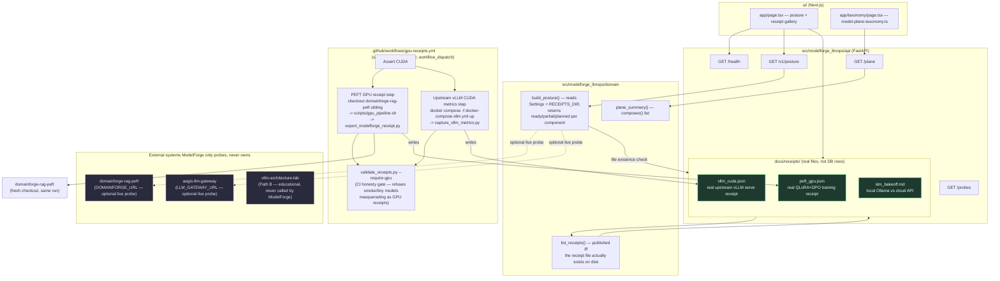

# ModelForge — Architecture

**One question this system answers:** *which weights, running where, and how do we prove it?*

ModelForge is the Model Plane spine layer (ADR-034) — it does not train or serve models itself.
It **composes** three real systems behind one honest posture surface and receipt gallery:
DomainForge (PEFT training), upstream vLLM (CUDA serving), and a local-vs-cloud SLM bake-off —
and it bridges to `aegis-llm-gateway` for the enforce/record half of the story.

## Diagram

## What each piece actually does (no aspirational boxes)

- **`build_posture()`** (`src/modelforge_llmops/domain/posture.py`) is the honesty core: a component's
  status is `"ready"` only if the corresponding receipt file exists on disk at request time — it is
  not a hardcoded flag anyone could forget to flip back. `peft`/`vllm_cuda`/`slm_bakeoff` go
  `ready`→`partial`/`planned` automatically the moment a receipt file is deleted or was never
  generated.
- **`list_receipts()`** (`domain/receipts.py`) is the single source of truth the UI's receipt gallery
  renders from — same file-existence rule, so the gallery can't show a "published" badge for a
  receipt that isn't actually there.
- **`gpu-receipts.yml`** is the only thing that ever writes real GPU receipts. It runs on a
  self-hosted runner (rented GPU, registered ephemerally — see the README's "Always-on GPU" honesty
  note) via `workflow_dispatch`, never on `ubuntu-latest` (no CUDA there, so it structurally cannot
  fabricate a GPU claim). The PEFT step checks out `domainforge-rag-peft` fresh as a sibling
  directory and runs its real training pipeline; the vLLM step runs actual upstream
  `vllm/vllm-openai` via `docker-compose.vllm.yml`, not a simulator.
- **`validate_receipts.py --require-gpu`** is a CI gate, not a suggestion: it refuses to let a
  `peft_smoke.json`-shaped placeholder claim `status=gpu`, and refuses a tiny/smoke `base_model`
  (e.g. `sshleifer/tiny-gpt2`) from ever being written as `peft_gpu.json`.
- **ModelForge never calls `vllm-architecture-lab`.** That repo is Path B (educational
  PagedAttention/batching simulator); ModelForge's Path A is real upstream vLLM. The two are kept
  structurally separate so a reader can never mistake one for the other.
- **`DOMAINFORGE_URL`/`LLM_GATEWAY_URL`** are optional live-probe settings (`pydantic_settings`,
  read from env) — when unset, `build_posture()` reports those components `partial`/`external` with
  the literal instruction text ("Set DOMAINFORGE_URL to probe..."), not a silently-green checkmark.

## Real receipts vs what they don't claim

| Receipt | What it proves | What it does not claim |
|---|---|---|
| `peft_gpu.json` | Real QLoRA SFT + DPO training ran on a live CUDA GPU (see `known_gaps` for what isn't measured) | A quality/win-rate score for the trained adapter — the eval harness isn't wired to real inference yet |
| `vllm_cuda.json` | Real upstream vLLM served the pipeline's actual configured model on a live GPU | Always-on production serving — this is one dated benchmark run |
| `slm_bakeoff.md` | A real local-Ollama run against the golden suite | A cloud-API comparison — deferred pending a capture-host API key |

See [ADR-034](https://github.com/vpeetla-ai/ai-architecture-portfolio/blob/main/adr/ADR-034-modelforge-model-plane.md),
[ADR-035](https://github.com/vpeetla-ai/ai-architecture-portfolio/blob/main/adr/ADR-035-real-gpu-receipt-methodology.md),
[ADR-037](https://github.com/vpeetla-ai/ai-architecture-portfolio/blob/main/adr/ADR-037-modelforge-phase2-close-out.md).
